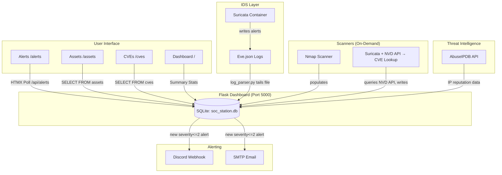

# Architecture Overview — SOC Station

## System Design



## Component Responsibilities

### 1. Suricata (IDS)
- **Role:** Detects network threats via rule-based analysis
- **Logs:** eve.json format with full metadata
- **Configuration:** `docker/suricata/suricata.yaml`
- **Placement:** Docker container on host or Raspberry Pi

### 2. Flask Dashboard (Zero Build, Python-only)
- **Routes:**
  - `/` — Home with stats
  - `/alerts` — HTMX-pollable live feed
  - `/assets` — Nmap discovery table
  - `/cves` — CVE lookup results
- **Database:** SQLite (only aggregated events — NOT raw logs)

### 3. Scanners
- **nmap_scanner.py:**
  - Runs Nmap against target CIDR range
  - Parses XML output for OS detection, service versions
  - Writes to `assets` table in SQLite
  
- **cve_lookup.py:**
  - Reads assets from SQLite
  - Matches services to NVD CPE strings
  - Queries NVD API (rate-limited with 24h cache)
  - Stores CVE data with severity, CVSS scores

### 4. Alert Pipeline
- **log_parser.py:**
  - Tails `eve.json` using seek-to-end polling
  - Filters for event_type='alert' only
  - Inserts into SQLite `alerts` table
  
- **alerter.py:**
  - Queries un-notified alerts where severity <= 2
  - Sends Discord webhook (primary) or SMTP email (optional)
  - Marks alerts as notified=1 post-success
  
- **threat_feed.py:**
  - Queries AbuseIPDB for source IPs in alerts
  - Caches results for 90 days
  - Populates `threat_intel` table for JOIN on dashboard

## Data Flow

```
Suricata Alert Event
    ↓ (writes to)
eve.json (host filesystem, Suricata container)
    ↓ (tail by)
log_parser.py → SQLite.alerts
    ↓ (query by)
alerter.py → Discord webhook / SMTP email
    ↓ (mark as notified in DB)
SQLite.alerts.notified = 1

Nmap Scan Triggered (manual or scheduled)
    ↓ (writes XML to)
/tmp/nmap_output.xml
    ↓ (parsed by)
nmap_scanner.py → SQLite.assets

CVE Lookup Triggered (manual or scheduled)
    ↓ (queries)
NVD API (https://services.nvd.nist.gov/rest/json/cves/2.0)
    ↓ (caches results in)
SQLite.cves
```

## Deployment Targets

1. **Raspberry Pi** — Single host running Suricata + Flask app via Docker Compose
2. **NAS (TrueNAS, Synology)** — Ideal for home lab with persistent disk space
3. **WSL2 (Windows)** — Run on Windows host with Docker Desktop

## Rate Limiting Strategy

| Service      | Free Tier Limit    | Cache Duration   |
|--------------|--------------------|------------------|
| NVD API      | 50 req / 30s       | 24 hours         |
| AbuseIPDB    | 100 req / day      | 90 days          |

Implementation:
- NVD API uses `last_fetched` column in `cves` table — re-query only if older than cache duration
- AbuseIPDB caches per IP in `threat_intel` table for 90 days

## Docker Compose Networks

```yaml
soc_network:  # Internal bridge network between services
  - suricata   # IDS container
  - dashboard  # Flask app container
```

**Note:** Suricata needs privileged access (`NET_ADMIN`) on first run to bind to network interfaces. Can be reduced after successful startup.

## Security Hardening Checklist (Phase 5)

- [ ] All secrets in `.env` file, never hardcoded
- [ ] Suricata runs as non-root user (requires initial privileged run)
- [ ] Database backups configured (optional — copy `db/soc_station.db` to external storage)
- [ ] API endpoints rate-limited at application layer
- [ ] Docker volumes isolated (`db_data`, `suricata/evtx/`, `suricata/eve.json`)
